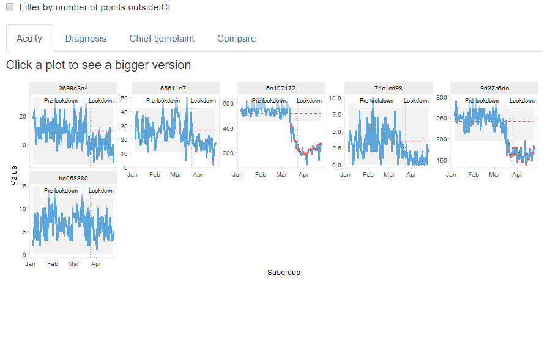
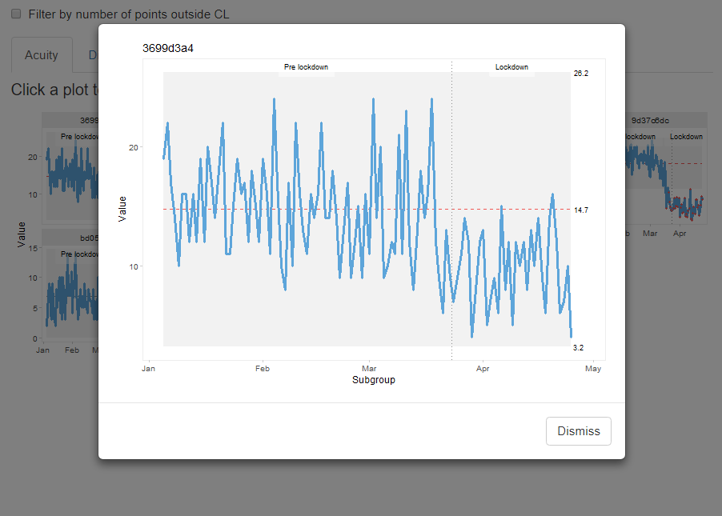
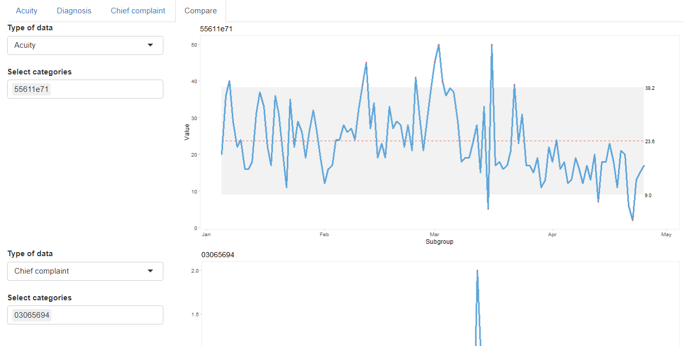
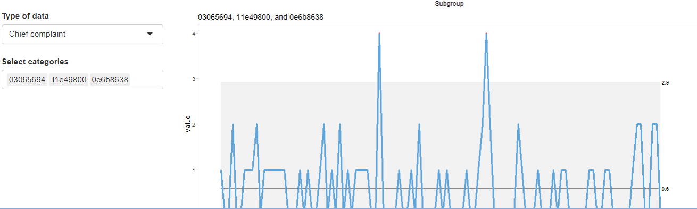

# Background

This was a Shiny application created for the Nottingham & Nottinghamshire ICS ([Integrated Care System](https://healthandcarenotts.co.uk/)) as part of the data analysis for Covid-19 to analyse the Emergency Care Data Set (ECDS) using a series of Statistical Process Control charts (SPCs) to determine which services where seeing an effect on admissions because of the pandemic.

The data in this repo is completely unrelated to the ECDS except for data names (Acuity, Diagnosis and Chief Complaint). The app used by Nottingham & Nottinghamshire ICS is hosted on Nottinghamshire Healthcare NHS Foundation Trust's Shiny server and is accessible only with individual assigned access. 

## Golem application

This app was built using Golem and to run this it is advisable to clone the repository to a computer and open the project `healthcareSPC.Rproj`. 

To run the application, open the file run_dev.R in the folder dev, or run the code `rstudioapi::navigateToFile("dev/run_dev.R")` in the console. Highlight all the code and run. Shorcut keys to run are <kbd>Ctrl + Return</kbd>.

## App

The first view when the app is run is:

### There are four tabs for this data: Acuity, Diagnosis, Chief Complaint and Compare. For the first 3 tabs, clicking on a chart expands it:

Note that Diagnosis and Chief Complaint take a while to load.

### The fourth tab is to compare 2 charts and can be selected using the drop down boxes on the left side of the app:

### More than one thing can be selected:

